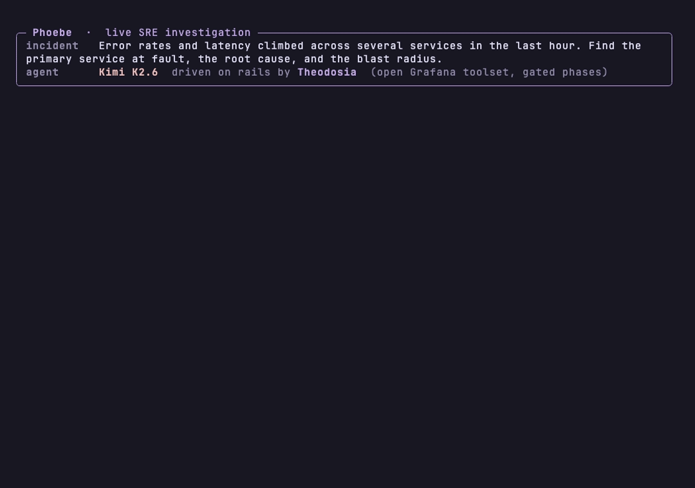

# Phoebe

An observability / SRE incident-investigation finite-state machine for LLM-driven agents. Mounts as an MCP server via [`theodosia`](https://github.com/msradam/theodosia); ships a [Harbor](https://harborframework.com/) agent for running against [Grafana's o11y-bench](https://github.com/grafana/o11y-bench).

The agent keeps the full Grafana toolset. Phoebe gates the procedure, not the tools: which phase you are in, whether you have cross-referenced enough backends, and whether you may conclude.

```text
start_investigation            open the case; discover datasources + schema
  │
  ├─ <full Grafana toolset>    query Prometheus / Loki / Tempo, list dashboards, ...
  │                            every call is recorded as evidence (record_probe)
  ├─ advance_phase(to, ...)    triage → diagnose → verify
  └─ conclude(...)             gated terminal
```

Hub topology: every action is reachable from every other. The methodology is enforced inside action bodies, not by narrowing the graph or the toolset (this is what lets a mid-size model *drive* the FSM instead of fighting it). `conclude` is gated: phase must be `verify`, you need evidence from ≥2 distinct telemetry backends, and at least one probe must have run during the verify phase. Each phase has a query budget, so once it is spent the only moves are `advance_phase` or `conclude`. A repeated identical probe is refused ("vary the probe").

A 1T-parameter open model (Kimi K2.6) stepping through a gated investigation on rails:



On o11y-bench investigation tasks, the same model (Kimi K2.6) was run two ways: free-ranging with the raw Grafana toolset, and on rails through this FSM. One failure recurs free-ranging: the agent trails off without delivering an answer. On `service-degradation-rca` it happens on all three runs (0.15, all empty); on `cache-refresh-lag-handoff` it happens on one of three (it solves it twice, fails once), so it misses Pass^3. On rails the `conclude` gate forces a committed, correct conclusion every time (1.0 on all three). Grader-verified evidence for both is in [bench/case_studies](bench/case_studies) and the [case study writeup](https://msradam.github.io/theodosia/case-study/). These are illustrative cases, not a leaderboard claim; an aggregate run is pending.

## What it gives the caller

- **Phase enforcement at the protocol layer.** The agent cannot conclude before reaching `verify`, cannot reach `verify` without evidence from ≥2 distinct backends, and cannot gather past a phase's query budget. The gates live in the action bodies; the toolset stays open.
- **Auditable trail.** Every tool call is recorded as evidence and every step is a row in Burr's tracker (`~/.theodosia/phoebe/<app_id>/log.jsonl`). Replayable, forkable, diffable. Tail it with `theodosia watch --project phoebe`.
- **Backend-agnostic.** The FSM doesn't hard-code Prometheus or Loki. The agent calls whatever Grafana tools its environment exposes; `record_probe` logs each call and tags its backend so the cross-reference gate stays honest.

## Install

```bash
pip install phoebe
```

For running as a Harbor agent against o11y-bench:

```bash
pip install 'phoebe[harbor]'
```

## Use standalone

```python
from phoebe import build_server

server = build_server()
server.run()  # serves over stdio MCP
```

Or via the theodosia CLI:

```bash
theodosia serve phoebe.app:build_application --name phoebe
```

## Use on o11y-bench

`phoebe.harbor:PhoebeAgent` is a [Harbor `BaseAgent`](https://www.harborframework.com/docs/agents) that wraps the FSM. It:

1. Walks the FSM via MCP
2. Routes the caller LLM's tool calls to Grafana's MCP server (`mcp-grafana`, exposed in Harbor's o11y-stack sidecar)
3. Returns the FSM's `final_answer` as the bench-graded response

To use it in an o11y-bench job:

```bash
mise run bench:job -- \
  --agent-import-path phoebe.harbor:PhoebeAgent \
  --model openai/meta-llama/Llama-3.3-70B-Instruct-Turbo \
  --task-name incident-triage \
  --n-attempts 3
```

## Why an FSM

The o11y-bench rubrics for the `investigation` task category grade on phase discipline:

- *"Recommendations appear only after the transcript shows queries from metrics, logs, or traces."*
- *"Response ties services to evidence from logs AND metrics."*
- *"Distinguishes primary vs cascade."*

These are exactly the criteria an FSM gate can enforce mechanically. SKILL.md prose describes the methodology; this FSM is the methodology, refusing illegal transitions. A weak model that would otherwise skip phases under pressure has no legal step to take except the next phase.

## Design note: gate the procedure, not the tools

The design went through three cuts, and the lesson is the boundary the FSM should enforce.

- **v0.1, two surfaces.** The agent used the raw Grafana tools to query, then *separately* called the FSM to record what it found. A mid-size model (Llama 3.3 70B) got absorbed in the query surface and never crossed to the bookkeeping surface, looping `query_prometheus` without ever advancing the FSM.
- **v0.2, one narrow surface.** Collapse to three query actions (`query_metrics` / `query_logs` / `query_traces`) that each run the query and record evidence in one step. This drove reliably, but it amputated capability: an ablation showed it roughly matching a raw-tools agent, because the agent could no longer reach traces it needed, list dashboards, or shape a query the way the task wanted.
- **v0.3, open toolset, gated procedure.** Keep the full Grafana toolset. Record every call as evidence through `record_probe`, and enforce the invariant in the action bodies: phases advance in order, `conclude` is gated behind cross-referenced evidence, and each phase has a query budget so the action space narrows to `advance_phase` / `conclude` once gathering is done. The FSM gates *when* and *whether*, never *which tool*.

The accompanying lesson on gate calibration: enforce the invariant that matters (don't conclude before cross-referencing ≥2 backends, don't conclude without a verifying probe) via action-body checks, and keep graph reachability broad so the agent is never told "no" by the graph for a normal operation. A repeated identical probe is refused with a specific reason ("vary the probe"), not a dead end.

## Repo layout

```
src/phoebe/
  app.py             FSM actions + graph + build_application + build_server
  prompts.py         Per-phase prompt templates
  harbor/            Harbor agent wrapper (optional dep)
tests/
```

## License

Apache 2.0.

## Notice

`phoebe` is independent open-source work by Adam Munawar Rahman and does not represent the views, positions, or technology roadmap of IBM Corporation or any other employer. It is built on [Apache Burr](https://github.com/apache/burr) and [theodosia](https://github.com/msradam/theodosia); references to Grafana's [o11y-bench](https://github.com/grafana/o11y-bench) are for integration purposes and do not imply endorsement.
