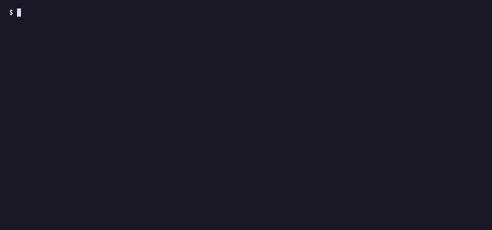
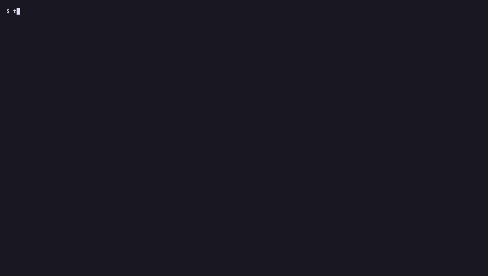
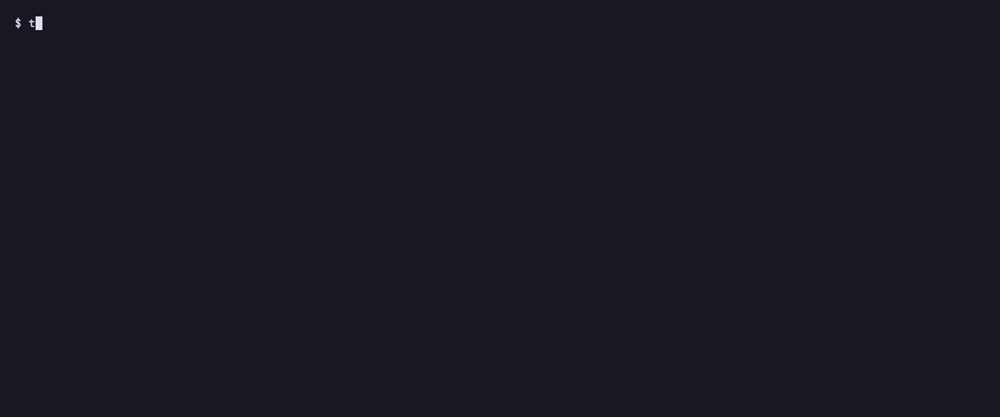

# Results: o11y-bench investigation category

## Headline: full investigation category, Pass^3 (2026-05-26)

The same model scores higher driving the enforced FSM than running free on the
raw Grafana toolset, on o11y-bench's full 11-task investigation category, Pass^3
(consistency across three runs per task), graded by o11y-bench's own rubric judge.

| Kimi K2.6 with | Investigation Pass^3 |
|---|---|
| Phoebe (this FSM), driven through Theodosia | **0.7524** |
| the raw Grafana toolset (o11y-bench's default agent) | 0.6842 |

Same model, same tasks, same grader, 33 trials per arm. The only thing that
changes is whether the model drives the enforced workflow or runs free. The
structure, not a bigger model, is the difference.

This is a preliminary independent run. Settings: `timeout_multiplier=1.0`, no
resource overrides, `n_attempts=3`, `n_concurrent=4` (concurrency affects only
parallelism, not per-trial scoring). A leaderboard submission is in progress;
the open question on submission scope and concurrency is tracked at
[grafana/o11y-bench#34](https://github.com/grafana/o11y-bench/issues/34).

It is **not** a model-versus-model claim. Phoebe is a purpose-built
investigation agent tuned against this category, so read the number as strong on
this category, not a universal guarantee. The honest comparison is same-model:
Phoebe plus Kimi versus the default agent plus Kimi.

The earlier exploratory run below (five tasks, partial-credit means) predates
this clean full-category run. It is kept for the boundary analysis and the MAST
mapping, not as the current headline number.

---

# Earlier exploratory run: o11y-bench investigation set (first run)

Date: 2026-05-25. A first, unoptimized run of the `phoebe` investigation
harness on Grafana's o11y-bench, with a real grading pass.

## Setup

- Harness: `phoebe`, an SRE incident-investigation finite state machine,
  mounted as an MCP server by [Theodosia](https://github.com/msradam/theodosia) (v0.1).
- Driver model: Kimi K2.6 (1T MoE, open weights) via Together, function
  calling. The model never sees Grafana directly. It drives the FSM; the FSM
  reaches Prometheus, Loki, and Tempo through Theodosia's upstream.
- Environment: o11y-bench's Grafana o11y-stack with seeded telemetry, one
  attempt per task.
- Grading: o11y-bench's rubric judge (Anthropic).

## The invariant is the agent logic

The investigation procedure is not a prompt the model may ignore. It is a
graph, designed once and served over MCP: one entry, a hub of operations,
phase gates, and a terminal. The model fills slots; the graph enforces the
order, like a circuit.



- `start_investigation` discovers the live datasources and the telemetry
  schema (metric names, labels, services), then sets phase to triage.
- `query_metrics` / `query_logs` / `query_traces` run real PromQL / LogQL /
  TraceQL and record the evidence. The operation is the FSM action.
- `advance_phase` moves triage to diagnose to verify. diagnose needs at least
  one finding; verify needs evidence from at least two distinct backends.
- `conclude` is gated: phase must be verify, with at least two backends and a
  probe taken during the verify phase.
- A repeated identical probe is refused by a loop guard; the agent varies it
  and continues.

Out-of-order and premature steps are refused server-side, with the legal next
actions carried on the response so the agent self-corrects. The whole session
is a replayable, inspectable trace.





## Baseline: untuned harness, single attempt (Kimi K2.6)

| Task | Reward | Reached a conclusion |
|---|---|---|
| incident-triage | 0.78 | yes |
| retry-backlog-incident | 0.30 | yes |
| promql-retry-backlog-triage | 0.30 | yes |
| payments-path-root-cause | 0.00 | yes |
| cache-incident-blast-radius | 0.00 | yes |
| **Mean** | **0.28** | **5 / 5** |

## Reading the baseline

Two axes, and they separate cleanly.

**Structural: 5 of 5 runs completed the procedure.** Every run discovered the
schema, queried at least two backends, advanced through the phases, and
produced an evidence-cited conclusion. No run skipped a phase, terminated
early, or crashed. That is what the FSM provides by construction, on a 1T open
model, at one attempt each.

**Semantic: mean 0.28, range 0.0 to 0.78. The FSM does not make the model
correct.** On `incident-triage` it scored 0.78 (8 of 9 rubric checks); the one
miss was stating the combined payment plus order 5xx share accurately, a
numeric error inside a valid step. The two zeros are wrong diagnoses, not
broken runs: on `payments-path-root-cause` the model blamed order-service when
the answer is the payments path through payment-service; on
`cache-incident-blast-radius` it called the incident broad when it is isolated
to user-service. In both, the agent followed the procedure and cited real
telemetry, then reasoned to the wrong conclusion.

This is the boundary stated plainly in the design: it enforces the shape of
the work, not the reasoning inside a step. Mapped onto the IBM Research and
UC Berkeley [MAST](https://huggingface.co/blog/ibm-research/itbenchandmast)
failure taxonomy, the FSM structurally prevents ordering violations, skipped
gates, and premature termination (FM-1.1, FM-1.5, FM-3.1). It does nothing for
incorrect verification (FM-3.3) or reasoning-action mismatch (FM-2.6), which
is exactly where the zeros land.

## Tuned harness, Pass^3: an open model reaches frontier parity

The baseline misses were reasoning gaps the agent could have closed with
evidence it already had: it only saw a short summary of each query result, so
it estimated shares, missed per-service blast radius, and never cited trace
IDs. The harness was tuned for that, generally, not per task: each query
response now returns the actual rows, and the prompts ask the model to
quantify from them, establish blast radius (which services are and are not
affected), query whatever specific endpoint or prior incident or rollout the
task names, and cite a trace ID. No task-specific logic; the graph is still a
generalized investigator.

Then the same five tasks, three attempts each, driven by an open model (Kimi
K2.6) and a frontier model (Claude Sonnet 4.6) through the identical harness.
Per-task mean reward across the three attempts:

| Task | Kimi K2.6 (open) | Claude Sonnet 4.6 |
|---|---|---|
| incident-triage | 0.78 | 0.78 |
| retry-backlog-incident | 0.88 | 1.00 |
| promql-retry-backlog-triage | 1.00 | 0.77 |
| payments-path-root-cause | 0.00 | 0.15 |
| cache-incident-blast-radius | 0.20 | 0.20 |
| **Mean** | **0.572** | **0.579** |

Two findings.

**The tuning roughly doubled the open model (0.28 to 0.572) without touching
the model or the tasks.** It was all in what the harness shows the agent and
asks of it. Two tasks that the baseline scored 0.30 went to 1.00 and 0.88.

**Through the same harness, the open model matches the frontier model.** Kimi
K2.6 at 0.572 and Sonnet 4.6 at 0.579 are a statistical tie on this set. The
harness is the equalizer: when the procedure is enforced and the evidence is
surfaced, a 1T open model investigates these incidents about as well as
Sonnet. The residual failures are shared, not model-specific: both score
exactly 0.78 on incident-triage (the same 5xx-share-accuracy miss), both land
0.20 on cache-incident-blast-radius (both fall for the broad-versus-isolated
trap two times in three), and both struggle on payments-path-root-cause. These
are task-level reasoning and verification limits, the FM-3.3 boundary, that
sit above the harness and below the model, and they do not move much between an
open and a frontier model.

A note on comparability: these are partial-credit rubric means at three
attempts. The public o11y-bench leaderboard reports Pass^3 (all three trials
must clear a threshold) over the full investigation category, a stricter,
binary metric on more tasks. The numbers here are not the leaderboard's
numbers and are not a submission. They are a controlled within-harness
comparison.

## Caveats

Five investigation tasks, one author, partial-credit rubric scoring. The
baseline is a single attempt; the tuned comparison is three attempts per task
per model. This is not a leaderboard submission and the numbers are not
directly comparable to the public Pass^3 category scores. It is a controlled
read: the harness drives real investigations to gradeable, auditable
conclusions, general tuning of what the harness surfaces and asks roughly
doubled an open model's score, and through the same harness that open model
investigates about as well as a frontier model, with the remaining failures
shared and sitting at the reasoning boundary the design does not claim to
cross.

## Reproduce

```bash
# stack on localhost (Grafana MCP on :8080)
docker run -d -p 3000:3000 -p 9090:9090 -p 3100:3100 -p 3200:3200 -p 8080:8080 \
  o11y-bench-o11y-stack:latest

# one task through the FSM, graded
mise run bench:job -- \
  --agent-import-path phoebe.harbor:PhoebeAgent \
  --model openai/moonshotai/Kimi-K2.6 \
  --task-name incident-triage --n-attempts 1
```
